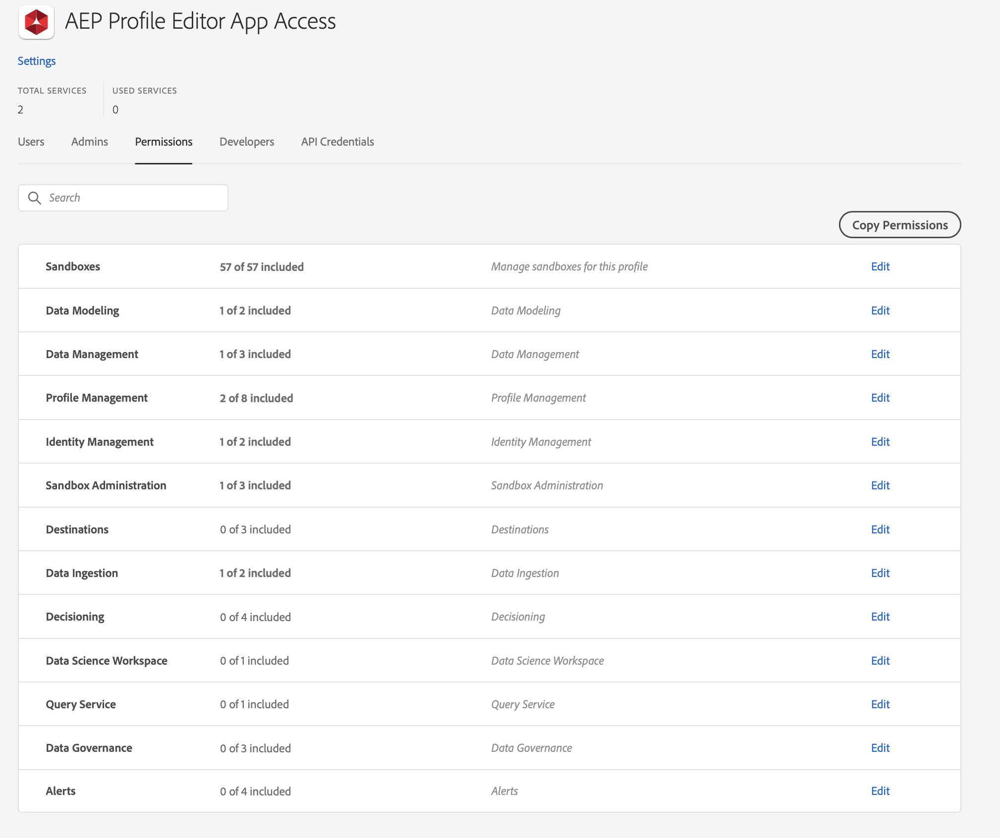

# Adobe Offer Decisioning Engine Previewer


<p align="center">
  <a href="https://github.com/nsfw-filter/nsfw-filter/releases/" target="_blank">
    
  </a>
  <a href="https://github.com/PulkitXChadha/aep-profile-editor/commits/master" target="_blank">
    
  </a>
  <a href="https://github.com/PulkitXChadha/aep-profile-editor/issues" target="_blank">
    
  </a>
  </br>
  <a href="https://github.com/PulkitXChadha/aep-profile-editor/pulls" target="_blank">
    
  </a>
  <a href="https://github.com/nsfw-filter/nsfw-filter/blob/master/LICENSE" target="_blank">
    
  <a>
  </a>
</p>
<hr>

<br> </br>
Welcome to Adobe Experience Platform Profile Editor, an Adobe I/O Application that lets you easily update and create profiles and experience events.  
<br> </br>

## Table Of Contents

- [Installation](#installation)
  - [Prerequisites](#prerequisites)
  - [Create Product Profile](#create-product-profile)
  - [Creating a new Project in Adobe Developer Console](#creating-a-new-project-in-adobe-developer-console)
  - [Install Project Locally](#install-project-locally)
  - [Test & Coverage](#test---coverage)
  - [Deploy & Cleanup](#deploy---cleanup)
- [Continuous Integration and Continuous Delivery (CI/CD)](#continuous-integration-and-continuous-delivery--ci-cd-)
- [Publishing your Firefly App](#publishing-your-firefly-app)
- [Project Folder Structure](#project-folder-structure)
- [Config Files](#config-files)
  - [`.env`](#-env-)
  - [`manifest.yml`](#-manifestyml-)
- [Additional Resources](#additional-resources)
  - [Adobe I/O](#adobe-i-o)
  - [Adobe Experience Platform - Unified Profile](#adobe-experience-platform---unified-profile)
  - [Adobe Offer Decisioning Engine](#adobe-offer-decisioning-engine)
- [Releases](#releases)
  - [v0.0.4](#v004)
  - [v0.0.3](#v003)
  - [v0.0.2](#v002)
  - [v0.0.1](#v001)
- [Features Requested](#features-requested)

## Installation

### Prerequisites

> To deploy and use this app you will need to provision Project Firefly on your Adobe Account. Follow the link for details on [How to Get Access to Project Firefly](https://www.adobe.io/apis/experienceplatform/project-firefly/docs.html#!AdobeDocs/project-firefly/master/overview/getting_access.md)

> Before you get started please ensure that you have all prerequisites on my workstation. Follow the link for details on how to [Setting up Your Environment](https://www.adobe.io/apis/experienceplatform/project-firefly/docs.html#!AdobeDocs/project-firefly/master/getting_started/setup.md)

### Create Product Profile

Access to all project Firefly apps is managed through [Adobe Admin Console](https://adminconsole.adobe.com). The recommended approach to managing access to the app using User Groups that have privileged Product Profiles. Follow the instructions below to set this up:

1. Create a user group with an appropriate name and description. Click `Save` when ready.

   

2. Create Adobe Experience Platform Product Profiles to manage privileges for the app workspaces. group with an appropriate name and description.

   - Go to Adobe Experience Platform Product in Admin console and click `New Profile`.
     

   - Give the Profile an appropriate name and description and click `Next` when ready.
     

   - No Additonal Services need to be selected for this application.
     

   - The app at least needs the following roles:

     - `View Schemas`
     - `View Datasets`
     - `View Profiles`
     - `Manage Profiles`
     - `View Identity Namespaces`
     - `View Sandboxes`
     - `View Sources`

   - Once all roles have been selected click `Save` when ready.
     

3. Add Teh User Group to the Product Profile

   

### Creating a new Project in Adobe Developer Console

Adobe Developer Console gives you access to APIs, SDKs, and developer tools to build on, integrate, and extend Adobe products. This app needs access to Adobe I/O Runtime credentials and access to Adobe Experience Platform APIs. Follow the instructions to set up your project:

1. Navigate to [Adobe Developer Console](https://console.adobe.io/).

2. Use the Org Switcher on the upper right corner to ensure or to select the Org you want to use.
   

3. Once you are in the correct organization, Under `Quick Start`, click on the option to `Create project from template`.
   **Note that if you don't this option, it might be because your request to access Project Firefly has not yet been approved.**

4. Select `Project Firefly` from the list of templates.
   

5. Enter `Project Title` and `App Name` for your templated project.

   - `Project Title` Give a descriptive title to e.e "**AEP Profile Editor \<\<company name\>\>**"
   - `App Name` Please enter "**aepProfileEditor**". This should match the project name in `package.json`

   - Click `Save` when ready.
     

6. You should see a new project has 2 default `Workspaces`. It is recommended to create workspaces for individual developers working on a project.

   - Create a new workspace by clicking the `+ Add workspace` button. Give the workspace an appropriate name and description.

   - Click `Save` when ready.

     

7. Within each of the workspace you will need to add the service needed for the app.

   - Click the `+ Add service` button and select `API`
     

   - Click on `Adobe Experience Platform` then select the `Experience Platform API` tile, click `Next ` when ready.
     

   - Select `Generate a new key pair` or upload a key pair you have already, click `Next ` when ready.
     

   - Select the product profile created for in preview sets and click `Save configured API`.
     

### Install Project Locally

1. On your machine, navigate to the Terminal and enter

   ```
   $ aio login
   ```

   This will open a browser window where you will need to enter your Adobe ID.
   

2. Clone the github repo

   ```
   $ git clone https://github.com/PulkitXChadha/aep-profile-editor.git
   ```

   

3. Change directory

   ```
   $ cd aep-profile-editor
   ```

4. Select the Organization, Project and workspace. the AIO CLI has helper commands to allow you to efficiently select the workspaces and have the app use the credentials associated with the workspace. The credentials included the `.aio`, `.env` and `config.json` files. You will need to run the following commands:

   - List all organizations you have access to `aio console org list`
   - Select the org you want to use `aio console org select <<IMS ORG>>`
   - List all Projects in the org `aio console project list`
   - Select the Project you want to use `aio console project select <<Project ID>>`
   - List all workspaces in the project `aio console workspace list`
   - Select the workspace you want to use `aio console workspace select <<workspace ID>>`
     

5. From within the project folder run the following command to downloads the relevant configuration files.

   ```
   $ aio app use
   ```

   

   This step will create `.aio`, `.env` and `config.json` files which include the credentials needed to run the app in the workspace.
   You can manually populate the `.env` file in the project root and fill it as shown [below](#env).

6. Install all node dependency libraries.From within the project folder run the following command

   ```
   $ npm install
   ```

7. Run locally (this step needs docker and docker images, see details in the [above](#prerequisites)). Ensure that Docker is running on you machine and run the following command:

   ```
   $ aio app:run --local
   ```

   > This step might that a few mins at first.

   > you might need to accept a self-signed certificate to use `https://localhost:9080`
   > When successful you should see the below message.
   > 

8. Copy and paste the URL `https://experience.adobe.com/?devMode=true#/custom-apps/?localDevUrl=https://localhost:9080` in a browser and you should see the app screen.
   

### Test & Coverage

- The project has > 150 unit tests for each of the UI and runtime actions. You can run these test by running the following command from the project folder

  ```
  $ npm run test
  ```

- To Run a test coverage report run the following command from the project folder
  ```
  $ npm run test-coverage
  ```

### Deploy & Cleanup

- `aio app deploy` to build and deploy all actions on Runtime and static files to CDN
- `aio app undeploy` to undeploy the app

## Continuous Integration and Continuous Delivery (CI/CD)

The repo uses GitHub Actions for CI/CD. The `.github/workflows` folder has all the workflows yml files used.

> You may need to modify and/or delete some of these workflow files.

For more information [CI/CD for Project Firefly Applications](https://www.adobe.io/apis/experienceplatform/project-firefly/docs.html#!AdobeDocs/project-firefly/master/guides/ci_cd_for_firefly_apps.md)

## Publishing your Firefly App

For instructions on how to publish and approve your app go to [Publishing a Project Firefly Applications](https://www.adobe.io/apis/experienceplatform/project-firefly/docs.html#!AdobeDocs/project-firefly/master/getting_started/publish_app.md)

---

## Project Folder Structure

```bash
├── actions  #this folder is intended for backend source code for all serverless actions
│   ├── misc
│   │   ├── get-aio-state.js # wrapper runtime action to get a state value from aio-lib-state
│   ├── PALM
│   │   ├── get-sandboxes.js # action to get a list of all sandboxes in the AEP instance
│   ├── UPS
│   │   ├── get-identity-namespaces.js # action to get list of all Identity Namespaces.
│   │   ├── get-identity-preview-report.js # action to get list of all populated Identity Namespaces.
│   │   ├── get-profile-experience-events.js # action to get experience events for the profile.
│   │   ├── get-profile.js # action to get Unified Profile based on an entity value lookup.
│   ├── utils.js
├── web-src   #this folder is intended for frontend source code such as html templates, react components, JS, CSS
│   ├── index.html
│   ├── src
│   │    ├── components
│   │    │    ├── About.js
│   │    │    ├── App.js
│   │    │    ├── ExperienceEventsView.js # React Component for displaying Experience Event Data.
│   │    │    ├── Home.js
│   │    │    ├── NamespaceList.js # React Component for Identity Namespace drop down.
│   │    │    ├── SandboxPicker.js  # React Component for Sandbox Picker Ribbon.
│   │    │    ├── SideBar.js  # React Component for Side Bar.
│   │    ├── context
│   │    │    ├── ProfileViewContext.js # React Context for profile attributes in decision rules.
│   │    ├── hooks
│   │    │    ├── useActionWebInvoke.js # React Custom Hook for caching runtime action responses.
│   │    ├── exc-runtime.js
│   │    ├── index.css
│   │    ├── index.js
│   │    ├── utils.js
├── e2e  #this folder is intended for end-to-end tests
├── test  #this folder is intended for back-end action unit tests and integration tests
│   ├── actions # contains all unit tests for runtime actions.
│   ├── web-src # contains all unit tests for UI components.
├── manifest.yml #this file describes the backend actions you would like to deploy or to redeploy
├── README.md
├── package.json #this file describes project definition and various metadata relevant to the project.
└── .gitignore
```

---

## Config Files

### `.env`

```bash
# This file must not be committed to source control

## please provide your Adobe I/O Runtime credentials
AIO_runtime_auth=
AIO_runtime_namespace=
AIO_runtime_apihost=
## Adobe I/O Console service account credentials (JWT) Api Key
SERVICE_API_KEY=
```

### `manifest.yml`

- List your backend actions under the `actions` field within the `__APP_PACKAGE__`
  package placeholder. We will take care of replacing the package name placeholder
  with your project name and version.
- For each action, use the `function` field to indicate the path to the action
  code.
- More documentation for supported action fields can be found
  [here](https://github.com/apache/incubator-openwhisk-wskdeploy/blob/master/specification/html/spec_actions.md#actions).

---

## Additional Resources

### Adobe I/O

- [Firefly Apps](https://github.com/AdobeDocs/project-firefly/blob/master/README.md#project-firefly-developer-guide)
- [Adobe I/O SDK](https://github.com/adobe/aio-sdk#adobeaio-sdk)
- [Adobe I/O Runtime](https://adobedocs.github.io/adobeio-runtime/)
- [React Spectrum](https://react-spectrum.adobe.com/react-spectrum/index.html)

### Adobe Experience Platform - Unified Profile

- [Overview](https://experienceleague.adobe.com/docs/experience-platform/profile/home.html?lang=en)
- [Unified Profile API Reference](https://experienceleague.adobe.com/docs/experience-platform/profile/home.html?lang=en#api)

## Releases

### v0.0.4

- Documentation of Installation instructions and usage.
- Added user selected form themes

### v0.0.3

- Changed Profile Lookup layout to minimize whitespace
- Added Component to add new profiles and events

### v0.0.2

- Toggle logic for edit profile button
- Fixed error thrown when no Events are found
- Added overflow to the schema list view
- Corrected Test Profile Search logic
- Added Experience Event Form views
- Fixed Pagination on the test Profiles page.

### v0.0.1

- Query Profile cache for test profiles
- Retrieved Profile and Experience Events using Entity APIs
- Display Profile Data in a Form
- Edit Profile Fragments and stream data into AEP Sandbox.

## Features Requested

- Add check to disable the edit button when no dataset for the schema exists. Or disable the dataset
- Add an Ease button to create a streaming source if there is nothing created.
- On Sandbox selection error unmount component.
